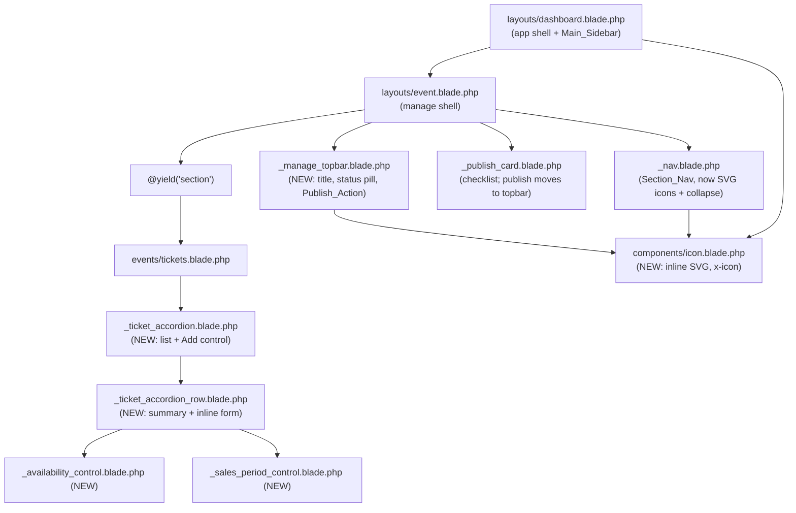
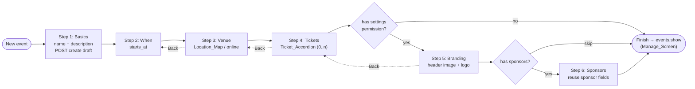

# Design Document

## Overview

This design redesigns the event authoring and management surfaces of the Laravel event ticketing platform. It is a UI-and-domain redesign layered on top of the existing controllers, models, routes, and the recently sharpened design tokens. No new frontend build step is introduced: everything is plain Blade, vanilla JavaScript, inline SVG, and the already-CDN-loaded Leaflet.

The work spans eight areas, each mapped to one or more requirements:

1. **Whole-row navigation** in the events and customers dashboard tables (Req 1).
2. **Collapsible sidebars** — the main dashboard sidebar and the per-event section sub-sidebar, with persistence (Req 2).
3. **Inline SVG icon system** replacing emoji throughout the authoring surfaces (Req 3).
4. **Multi-step create wizard** replacing the slim create form (Req 4).
5. **Publish action on the manage top bar** (Req 5).
6. **Inline accordion ticket-type component** replacing the current show/hide table (Req 6).
7. **Availability control** — the three-way `capacity_mode` chooser, adding `unlimited` (Req 7).
8. **Sales-period control** — default-checked checkboxes with optional datetimes, and the accompanying `isOnSaleAt` semantic change (Req 8).

Plus two cross-cutting concerns: **schema additions** for `ticket_types.description` and the `unlimited` mode (Req 9), and **authoring polish** — inline help, design tokens, preserved tenant scoping / permission gates / free-ticket support, and accessibility (Req 10).

The single most consequential change is a **semantic redefinition of the ticket sale window**. Today a ticket with a null `sale_starts_at` or null `sale_ends_at` is treated as *never on sale*. The redesign flips this: a null bound means *unbounded on that side* — publication is the effective lower bound and the event start time is the effective upper bound. This changes `TicketType::isOnSaleAt()`, `TicketType::isPurchasableAt()`, the checkout gate, the public event page's `on_sale`/`sale_state` fields, and existing tests. It is called out explicitly in every affected section below.

### Design principles carried forward

- **Tenant scoping is untouched.** Every Event/TicketType query already runs under the `dashboard.tenant` binding and the `BelongsToCompany` global scope; foreign rows 404. New controller actions reuse the same gates (`ACTION_MANAGE_EVENTS`, `ACTION_MANAGE_TICKET_TYPES`) and the `settings` permission for branding/sponsors.
- **Progressive enhancement.** Accordion and wizard work as plain form POSTs without JavaScript; JS only enhances (single-open accordion, click-anywhere rows, show/hide datetime inputs). This keeps the "no build step" constraint honest and keeps everything keyboard-operable.
- **Design tokens.** All new CSS uses the existing tokens (`--radius`, `--radius-chip`, `--brand`, `--border`, `--muted`, the global `:focus-visible` ring) and existing component classes (`.panel`, `.data-table`, `.choice`, `.wizard-*`, `.section-nav`, `.pill`).

## Architecture

### Component map (manage screen)



### Wizard flow



Every step is a real HTTP request against the draft `Event` row, so validation reuses existing rules and state survives refresh, back/forward navigation, and permission gating naturally.

### Server-driven wizard rationale

Two candidate approaches were considered:

- **Single-page client-side stepper** (all steps in one form, JS shows one panel at a time, one final submit). Rejected: the venue step needs a live Leaflet map + server geocode, branding needs a real multipart file upload, and tickets need multiple persisted child records. Holding all of that in one un-submitted form is fragile, loses work on refresh, and would need bespoke client-side validation duplicating the server rules.
- **Server-driven wizard** (chosen). Step 1 creates the `Event` as a draft; each subsequent step is a GET (render) + POST/PATCH (persist + advance) against that draft, **reusing the existing per-section update actions and validators**. State lives in the draft row itself. Back is just a link to the previous step's GET. This reuses `EventController::updateLocation`, the ticket-type store/update actions, the branding controller, and the sponsor store action with almost no new validation logic.

A new thin `EventWizardController` orchestrates step routing and rendering; the actual persistence delegates to the existing controllers/services where possible.

### New / changed routes

All within the existing dashboard group (`prefix dashboard`, `name dashboard.`, middleware `auth`, `verified`, `company.active`, `session.timeout`, `dashboard.tenant`).

| Method | URI | Name | Action |
| --- | --- | --- | --- |
| GET | `/events/create/{step?}` | `events.create` (kept) | `EventWizardController@start` (step 1) |
| POST | `/events/wizard` | `events.wizard.store` | `EventWizardController@store` (creates draft, → step 2) |
| GET | `/events/{event}/setup/{step}` | `events.wizard.step` | `EventWizardController@step` |
| POST/PATCH | `/events/{event}/setup/{step}` | `events.wizard.save` | `EventWizardController@save` (persist + advance) |
| DELETE | `/events/{event}/ticket-types/{ticketType}` | `events.ticket-types.destroy` | `TicketTypeController@destroy` (NEW) |

The wizard `save` action dispatches per step to the existing validators/logic (see Components). `events.create` keeps its name so existing links (the "New event" button in `events/index.blade.php` and the main sidebar) keep working; it now renders the wizard's first step instead of the slim form. The old `events.store` route/action is superseded by `events.wizard.store` but left registered (harmless) to avoid breaking any programmatic callers or the event-experience-polish hero-on-create contract; it can be removed in a later cleanup.

The ticket-type `destroy` route is added because the accordion offers a Remove control (Req 6 lists Add/edit/save/cancel but a live authoring list realistically needs delete; kept minimal — gated on `ACTION_MANAGE_TICKET_TYPES`, refuses to drop the last type when the event is published so it never violates the "≥1 ticket type to publish" blocker).

## Components and Interfaces

### 1. Inline SVG icon system (Req 3)

**Decision: an anonymous Blade component `x-icon`**, not `@include`. Blade components give a clean `<x-icon name="ticket" class="section-nav__ico" />` call site, support attribute merging for `class`, and need no build step (Blade compiles them at runtime like any view). This fits the codebase, which already uses Blade heavily and has no asset pipeline.

**File:** `resources/views/components/icon.blade.php`

```blade
@props(['name'])
@php
    // Lucide-style 24x24 stroke icons. Each entry is the inner markup of the
    // <svg>. Decorative by default: aria-hidden + focusable="false". Callers
    // that need a labelled icon pass their own aria-label and role via $attributes.
    $paths = [
        // Section nav
        'overview' => '<rect x="3" y="3" width="7" height="7"/><rect x="14" y="3" width="7" height="7"/><rect x="14" y="14" width="7" height="7"/><rect x="3" y="14" width="7" height="7"/>',
        'location' => '<path d="M20 10c0 6-8 12-8 12s-8-6-8-12a8 8 0 0 1 16 0Z"/><circle cx="12" cy="10" r="3"/>',
        'tickets'  => '<path d="M3 9a2 2 0 0 1 2-2h14a2 2 0 0 1 2 2v1a2 2 0 0 0 0 4v1a2 2 0 0 1-2 2H5a2 2 0 0 1-2-2v-1a2 2 0 0 0 0-4Z"/><path d="M13 5v14"/>',
        'branding' => '<circle cx="13.5" cy="6.5" r="2.5"/><circle cx="17.5" cy="10.5" r="2.5"/><circle cx="8.5" cy="7.5" r="2.5"/><circle cx="6.5" cy="12.5" r="2.5"/><path d="M12 2a10 10 0 0 0 0 20 2 2 0 0 0 2-2 2 2 0 0 1 2-2h1a4 4 0 0 0 4-4 10 10 0 0 0-9-10Z"/>',
        'sponsors' => '<path d="m12 2 3 7h7l-5.5 4.5L18 21l-6-4-6 4 1.5-7.5L2 9h7Z"/>',
        'share'    => '<circle cx="18" cy="5" r="3"/><circle cx="6" cy="12" r="3"/><circle cx="18" cy="19" r="3"/><path d="m8.6 13.5 6.8 4M15.4 6.5 8.6 10.5"/>',
        'report'   => '<path d="M3 3v18h18"/><path d="m7 14 4-4 3 3 5-5"/>',
        'orders'   => '<path d="M8 2h8l2 4v14a1 1 0 0 1-1 1H7a1 1 0 0 1-1-1V6Z"/><path d="M8 10h8M8 14h8M8 18h5"/>',
        'history'  => '<path d="M3 12a9 9 0 1 0 3-6.7L3 8"/><path d="M3 3v5h5"/><path d="M12 7v5l3 2"/>',
        // Main sidebar
        'dashboard'=> '<path d="M3 13h8V3H3Zm10 8h8V3h-8ZM3 21h8v-6H3Z"/>',
        'events'   => '<rect x="3" y="4" width="18" height="18" rx="2"/><path d="M16 2v4M8 2v4M3 10h18"/>',
        'customers'=> '<path d="M16 21v-2a4 4 0 0 0-4-4H6a4 4 0 0 0-4 4v2"/><circle cx="9" cy="7" r="4"/><path d="M22 21v-2a4 4 0 0 0-3-3.9"/>',
        'reports'  => '<path d="M3 3v18h18"/><rect x="7" y="12" width="3" height="6"/><rect x="12" y="8" width="3" height="10"/><rect x="17" y="5" width="3" height="13"/>',
        'scan'     => '<path d="M3 7V5a2 2 0 0 1 2-2h2M17 3h2a2 2 0 0 1 2 2v2M21 17v2a2 2 0 0 1-2 2h-2M7 21H5a2 2 0 0 1-2-2v-2M7 12h10"/>',
        'team'     => '<path d="M17 21v-2a4 4 0 0 0-4-4H5a4 4 0 0 0-4 4v2"/><circle cx="9" cy="7" r="4"/><path d="M23 21v-2a4 4 0 0 0-3-3.9M16 3.1a4 4 0 0 1 0 7.8"/>',
        'settings' => '<circle cx="12" cy="12" r="3"/><path d="M19.4 15a1.6 1.6 0 0 0 .3 1.8l.1.1a2 2 0 1 1-2.8 2.8l-.1-.1a1.6 1.6 0 0 0-2.7 1.1V21a2 2 0 0 1-4 0v-.1A1.6 1.6 0 0 0 7 19.4a1.6 1.6 0 0 0-1.8.3l-.1.1a2 2 0 1 1-2.8-2.8l.1-.1a1.6 1.6 0 0 0-1.1-2.7H1a2 2 0 0 1 0-4h.1A1.6 1.6 0 0 0 2.6 7a1.6 1.6 0 0 0-.3-1.8l-.1-.1a2 2 0 1 1 2.8-2.8l.1.1A1.6 1.6 0 0 0 7 2.6h.1A1.6 1.6 0 0 0 8 1.1V1a2 2 0 0 1 4 0v.1A1.6 1.6 0 0 0 15 2.6a1.6 1.6 0 0 0 1.8-.3l.1-.1a2 2 0 1 1 2.8 2.8l-.1.1a1.6 1.6 0 0 0 1.1 2.7H21a2 2 0 0 1 0 4h-.1a1.6 1.6 0 0 0-1.5 1Z"/>',
        'payments' => '<rect x="2" y="5" width="20" height="14" rx="2"/><path d="M2 10h20"/>',
        'storefront'=> '<path d="M3 9 4 4h16l1 5M4 9v11h16V9M4 9h16"/>',
        'help'      => '<circle cx="12" cy="12" r="10"/><path d="M9.1 9a3 3 0 0 1 5.8 1c0 2-3 3-3 3"/><path d="M12 17h.01"/>',
        'support'   => '<path d="M21 15a2 2 0 0 1-2 2H7l-4 4V5a2 2 0 0 1 2-2h14a2 2 0 0 1 2 2Z"/>',
        'activity'  => '<path d="M22 12h-4l-3 9L9 3l-3 9H2"/>',
        // Status flags + chrome
        'check'     => '<path d="m20 6-11 11-5-5"/>',
        'cross'     => '<path d="M18 6 6 18M6 6l12 12"/>',
        'dash'      => '<path d="M5 12h14"/>',
        'chevron'   => '<path d="m6 9 6 6 6-6"/>',
        'plus'      => '<path d="M12 5v14M5 12h14"/>',
        'menu'      => '<path d="M4 6h16M4 12h16M4 18h16"/>',
        'panel-left'=> '<rect x="3" y="3" width="18" height="18" rx="2"/><path d="M9 3v18"/>',
    ];
    $inner = $paths[$name] ?? '';
@endphp
<svg {{ $attributes->merge(['class' => 'icon']) }}
     width="20" height="20" viewBox="0 0 24 24" fill="none"
     stroke="currentColor" stroke-width="1.75" stroke-linecap="round" stroke-linejoin="round"
     aria-hidden="true" focusable="false">{!! $inner !!}</svg>
```

- Decorative by default (`aria-hidden="true"`, `focusable="false"`) — satisfies Req 3.4. Every icon is rendered adjacent to a visible text label (nav labels, status `sr-only` text), satisfying Req 3.5.
- `stroke="currentColor"` so icons inherit link colour (active/hover) automatically.
- Replaces every emoji in `_nav.blade.php` (`$links` `icon` values become icon `name` keys) and every `<span class="nav-ico">&#…;</span>` in `layouts/dashboard.blade.php`. The checklist and section-nav status flags (`&check;`/`&times;`/`&ndash;`) become `<x-icon name="check|cross|dash" />` (Req 3.2).

### 2. Section_Nav + Main_Sidebar: SVG + collapse (Req 2, 3)

**`_nav.blade.php`** — the `$links` array gains an `icon` key holding an icon *name* (`overview`, `location`, `tickets`, `branding`, `sponsors`, `share`, `report`, `orders`, `history`). The `<span class="section-nav__ico">{{ $link['icon'] }}</span>` becomes `<x-icon :name="$link['icon']" class="section-nav__ico" />`. Status flags likewise become `<x-icon>`.

**Collapse behaviour** — pure CSS class toggles plus tiny vanilla JS with `localStorage` persistence.

- **Main_Sidebar:** a collapse control in the header/sidebar toggles `app-shell--rail` on `#appShell`. Collapsed = icons-only rail (`--sidebar-w` shrinks to e.g. `64px`; `.nav-link` text and `.nav-section` headings hidden, icons centred). Persisted under key `ck.sidebar.main` (`"rail"|"open"`). This is separate from the existing mobile `nav-open` drawer, which is preserved unchanged for mobile widths.
- **Section_Nav:** a collapse control in the `.event-manage__nav` header toggles `event-manage--rail` on the `.event-manage` container. Collapsed = section nav shows icon-only links; the publish checklist card collapses to a compact summary. Persisted under key `ck.sidebar.section`.

Toggle buttons are real `<button type="button">` with `aria-expanded`, `aria-controls`, and an `aria-label` ("Collapse navigation" / "Expand navigation") plus an `<x-icon name="panel-left" />` (Req 2.7). Icon-only rail links keep their accessible name via a `title` attribute and a visually-hidden `<span class="sr-only">` label so screen readers still announce them.

**JS** (added to the `layouts/dashboard` inline script and a small block in `layouts/event`):

```js
// Generic collapse toggle with persistence.
function bindCollapse(btnId, targetId, cls, storeKey) {
    var btn = document.getElementById(btnId), target = document.getElementById(targetId);
    if (!btn || !target) return;
    if (localStorage.getItem(storeKey) === 'rail') target.classList.add(cls);
    var sync = function () { btn.setAttribute('aria-expanded', target.classList.contains(cls) ? 'false' : 'true'); };
    sync();
    btn.addEventListener('click', function () {
        var railed = target.classList.toggle(cls);
        localStorage.setItem(storeKey, railed ? 'rail' : 'open');
        sync();
        if (window.__eventMap) setTimeout(function () { window.__eventMap.invalidateSize(); }, 200);
    });
}
```

Mobile (< ~860px): collapse controls are hidden and the existing drawer (`nav-open` + backdrop) is the navigation affordance (Req 2.6). The rail classes are desktop-only (guarded by a media query).

### 3. Publish_Action on the manage top (Req 5)

**New partial `resources/views/dashboard/events/_manage_topbar.blade.php`**, rendered by `layouts/event.blade.php` in the existing `.page-head` row, replacing the "All events" link cluster with a fuller action bar:

- Left: event name + status `pill` (`pill--live` / `pill--draft`) — the published-state indicator (Req 5.3).
- Right: the **Publish** button (or **Unpublish** when live) plus "All events".

The publish/unpublish forms move here from `_publish_card.blade.php` (the card keeps the checklist only). Publish posts to `dashboard.events.publish`; the existing `EventController::publish()` gating via `publishBlockers()` and the `publish_errors` flash are unchanged (Req 5.2). The whole top bar is only rendered for users who pass `Gate::allows(ACTION_MANAGE_EVENTS)` — the same gate every manage screen already enforces — and the button is `@disabled` when required blockers remain, mirroring today's card behaviour (Req 5.4). Unpublish stays available while live.

```blade
<div class="manage-topbar">
    <div class="manage-topbar__title">
        <h1>{{ $event->name }}</h1>
        <span class="pill {{ $event->isPublished() ? 'pill--live' : 'pill--draft' }}">
            {{ $event->isPublished() ? 'Published' : 'Draft' }}
        </span>
    </div>
    <div class="manage-topbar__actions">
        @if ($event->isPublished())
            <form method="POST" action="{{ route('dashboard.events.unpublish', $event) }}">@csrf
                <button class="btn btn-outline">Unpublish</button></form>
        @else
            <form method="POST" action="{{ route('dashboard.events.publish', $event) }}">@csrf
                <button class="btn" @disabled(! $allRequiredMet)>Publish event</button></form>
        @endif
        <a class="btn btn-outline" href="{{ route('dashboard.events.index') }}">All events</a>
    </div>
</div>
```

`$allRequiredMet` is computed once in `layouts/event.blade.php` from `$readiness->items()` (same logic currently in `_publish_card`), and passed to both the topbar and the card so they never disagree.

### 4. Ticket_Accordion (Req 6, 7, 8, 9)

Replaces `dashboard/events/_ticket_types.blade.php` (the table + `data-toggle` rows) with an accordion.

**Files:**
- `resources/views/dashboard/events/_ticket_accordion.blade.php` — the list wrapper + "Add ticket type" control.
- `resources/views/dashboard/events/_ticket_accordion_row.blade.php` — one summary row + inline edit form (reused for existing rows and the new-row template).
- `resources/views/dashboard/events/_availability_control.blade.php` — the three-way radio (Req 7).
- `resources/views/dashboard/events/_sales_period_control.blade.php` — the two checkboxes + conditional datetimes (Req 8).

**Structure of one row:**

```blade
<div class="ticket-acc__item" data-ticket-row>
    <button type="button" class="ticket-acc__summary" data-acc-toggle
            aria-expanded="false" aria-controls="tt-form-{{ $id }}">
        <span class="ticket-acc__name">{{ $name }}</span>
        <span class="ticket-acc__price">{{ $priceLabel }}</span>
        <span class="ticket-acc__remaining">{{ $remainingLabel }}</span>
        <span class="pill {{ $statusPill }}">{{ $statusLabel }}</span>
        <x-icon name="chevron" class="ticket-acc__chev" />
    </button>
    <div class="ticket-acc__body" id="tt-form-{{ $id }}" hidden>
        <form method="POST" action="{{ $action }}" class="ticket-form">
            @csrf @if($existing) @method('PUT') @endif
            <div class="ticket-form__grid">   {{-- two-column on desktop --}}
                {{-- name, price, description --}}
                @include('dashboard.events._availability_control', ...)
                @include('dashboard.events._sales_period_control', ...)
            </div>
            <div class="form-actions">
                <button type="submit" class="btn btn-sm">Save ticket</button>
                <button type="button" class="btn btn-outline btn-sm" data-acc-cancel>Cancel</button>
                @if($existing)
                    <button type="submit" class="btn btn-danger btn-sm ticket-form__delete"
                            formaction="{{ route('dashboard.events.ticket-types.destroy', [$event, $tt]) }}"
                            formmethod="POST" name="_method" value="DELETE"
                            onclick="return confirm('Remove this ticket type?')">Remove</button>
                @endif
            </div>
        </form>
    </div>
</div>
```

**Summary strings (derived server-side, so they match the domain exactly):**

- **Price:** `$tt->isFree() ? 'Free' : $symbol.number_format($tt->price_minor/100, 2)` — £0 shows "Free" (Req 6.9, 10.5).
- **Remaining / total:** using the existing `availabilityFor($eventRemaining)`:
  - capped → `number_format($available).' / '.number_format($tt->capacity)`
  - shared_pool → `$eventRemaining === null ? 'Shared pool · unlimited' : number_format($eventRemaining).' shared'`
  - unlimited → `'Unlimited'`
- **Sales status** (a new helper `TicketType::saleStatusLabel(Carbon $now)`, returning one of `On sale` / `Scheduled` / `Ended` / `Not on sale` with a matching pill class). Derived from the *new* `isOnSaleAt` semantics against `sale_starts_at`, `sale_ends_at`, and the event start:
  - `On sale` (`pill--live`) — event published and `isOnSaleAt($now)`.
  - `Scheduled` (`pill--draft`) — a lower bound exists and is in the future, or the event is not yet published.
  - `Ended` (`pill--draft`) — an effective upper bound (explicit `sale_ends_at`, else event start) is in the past.
  - `Not on sale` — fallback (e.g. draft with no dates).

**New-row creation — client-side clone, then normal POST (chosen).** "Add ticket type" clones a hidden `<template data-ticket-new>` (a blank row rendered from `_ticket_accordion_row` with `$existing = false`, posting to `dashboard.events.ticket-types.store`), appends it expanded, and focuses the name field. This is the simplest robust approach with no build step: the new row is a plain form that POSTs to the existing `store` route and the page reloads with the persisted row. No draft/AJAX plumbing. The MIN 1 / MAX 50 per-event ceiling in `TicketTypeController` is unchanged (Add is hidden client-side once 50 rows exist, and the server still enforces it).

**Accordion JS** (`resources/views/dashboard/events/_ticket_accordion.blade.php` `@push('scripts')`):

```js
(function () {
    var root = document.querySelector('[data-ticket-accordion]');
    if (!root) return;

    function collapseAll(except) {
        root.querySelectorAll('[data-acc-toggle]').forEach(function (btn) {
            if (btn === except) return;
            btn.setAttribute('aria-expanded', 'false');
            document.getElementById(btn.getAttribute('aria-controls')).hidden = true;
        });
    }
    // Click anywhere on the summary button toggles; nested controls inside the
    // BODY are separate DOM (below the summary) so they never trigger it. The
    // summary itself is a <button>, so Enter/Space work natively + it is focusable.
    root.addEventListener('click', function (e) {
        var toggle = e.target.closest('[data-acc-toggle]');
        if (toggle && root.contains(toggle)) {
            var body = document.getElementById(toggle.getAttribute('aria-controls'));
            var open = toggle.getAttribute('aria-expanded') === 'true';
            if (open) { toggle.setAttribute('aria-expanded', 'false'); body.hidden = true; }
            else { collapseAll(toggle); toggle.setAttribute('aria-expanded', 'true'); body.hidden = false; }
            return;
        }
        var cancel = e.target.closest('[data-acc-cancel]');
        if (cancel) {
            var b = cancel.closest('.ticket-acc__body');
            var t = root.querySelector('[aria-controls="' + b.id + '"]');
            // Discard edits: reset the form to its server-rendered values.
            b.querySelector('form').reset();
            t.setAttribute('aria-expanded', 'false'); b.hidden = true;
            t.focus();
        }
    });
    // "Add ticket type": clone the blank template, expand it, focus name.
    var addBtn = root.querySelector('[data-acc-add]');
    var tpl = root.querySelector('[data-ticket-new]');
    if (addBtn && tpl) addBtn.addEventListener('click', function () {
        var frag = tpl.content.cloneNode(true);
        root.querySelector('[data-acc-list]').appendChild(frag);
        var last = root.querySelector('[data-acc-list] .ticket-acc__item:last-child');
        var t = last.querySelector('[data-acc-toggle]');
        collapseAll(t); t.setAttribute('aria-expanded', 'true');
        document.getElementById(t.getAttribute('aria-controls')).hidden = false;
        last.querySelector('input[name="name"]').focus();
    });
})();
```

- **Single-open** (Req 6.5): `collapseAll(except)` before expanding.
- **Click-anywhere** (Req 6.4): the whole summary is one `<button>`; edit-form controls live in a sibling body element, never inside the summary, so they can't trigger a toggle.
- **Keyboard** (Req 6.11): summary is a native button (Enter/Space/focus for free); Cancel returns focus to the summary.
- **Cancel discards** (Req 6.8): `form.reset()` restores server-rendered values, then collapses.
- **No-JS fallback:** rows render with the body `hidden`; without JS the `<button>` does nothing, but the create/edit forms still work if the body is shown. Acceptable because the manage screen is an authenticated admin surface; progressive enhancement keeps POST semantics intact.

#### 4a. Availability_Control (Req 7)

`_availability_control.blade.php` — three `.choice` radio chips bound to `capacity_mode`, replacing the old `<select>` (Req 7.5):

```blade
@php $mode = old('capacity_mode', $ticketType?->capacity_mode ?? \App\Models\TicketType::MODE_CAPPED); @endphp
<fieldset class="field ticket-form__availability">
    <legend>Availability</legend>
    <label class="choice"><input type="radio" name="capacity_mode" value="capped" data-availability
        @checked($mode === 'capped')> Limited quantity</label>
    <label class="choice"><input type="radio" name="capacity_mode" value="shared_pool" data-availability
        @checked($mode === 'shared_pool')> Use event capacity</label>
    <label class="choice"><input type="radio" name="capacity_mode" value="unlimited" data-availability
        @checked($mode === 'unlimited')> Unlimited</label>

    <div class="field" data-capacity-field @if($mode !== 'capped') hidden @endif>
        <label>Quantity</label>
        <input type="number" name="capacity" min="1" max="1000000"
               @if($mode === 'capped') required @endif
               value="{{ old('capacity', $ticketType?->capacity) }}">
    </div>
</fieldset>
```

- "Limited quantity" → `capped` + shows the quantity input (Req 7.2). "Use event capacity" → `shared_pool` (Req 7.3). "Unlimited" → `unlimited` (Req 7.4).
- JS (a small block) shows the quantity input only for `capped`, and `disabled`s it otherwise so it isn't submitted (mirrors the existing `_form.blade.php` pattern). Reuses the `.choice:has(input:checked)` styling already in `app.css`.

#### 4b. Sales_Period_Control (Req 8)

`_sales_period_control.blade.php`:

```blade
@php
    // A saved null bound => the corresponding "use default" checkbox is checked.
    $startDefault = old('sale_starts_default', $ticketType ? ($ticketType->sale_starts_at === null) : true);
    $endDefault   = old('sale_ends_default',   $ticketType ? ($ticketType->sale_ends_at === null)   : true);
@endphp
<fieldset class="field ticket-form__sales">
    <legend>Sales period</legend>

    <label class="consent">
        <input type="checkbox" name="sale_starts_default" value="1" data-sales-start-default @checked($startDefault)>
        Start selling when the event goes live
    </label>
    <div class="field" data-sales-start @if($startDefault) hidden @endif>
        <label>Start selling at</label>
        <input type="datetime-local" name="sale_starts_at" @disabled($startDefault)
               value="{{ old('sale_starts_at', $ticketType?->sale_starts_at?->format('Y-m-d\TH:i')) }}">
    </div>

    <label class="consent">
        <input type="checkbox" name="sale_ends_default" value="1" data-sales-end-default @checked($endDefault)>
        Stop selling when the event starts
    </label>
    <div class="field" data-sales-end @if($endDefault) hidden @endif>
        <label>Stop selling at</label>
        <input type="datetime-local" name="sale_ends_at" @disabled($endDefault)
               value="{{ old('sale_ends_at', $ticketType?->sale_ends_at?->format('Y-m-d\TH:i')) }}">
    </div>
</fieldset>
```

- Both checkboxes default-checked (Req 8.1, 8.2). Checked → the datetime input is `hidden` **and** `disabled`, so it isn't submitted → controller persists `null` (Req 8.3, 8.4, 8.9).
- Unchecking a checkbox reveals + enables its datetime input (Req 8.5, 8.6). JS:

```js
function bindSales(chk, box) {
    var input = box.querySelector('input');
    function sync() { box.hidden = chk.checked; input.disabled = chk.checked; }
    chk.addEventListener('change', sync); sync();
}
```

### 5. Multi-step create wizard (Req 4)

**`EventWizardController`** — new controller, all actions gated `ACTION_MANAGE_EVENTS`.

Steps enum (ordered): `basics`, `when`, `venue`, `tickets`, `branding`, `sponsors`. `branding` and `sponsors` are only reachable when the user `can('settings')` (Req 4.14) — otherwise the flow ends after `tickets`.

Method signatures:

```php
final class EventWizardController extends Controller
{
    private const STEPS = ['basics', 'when', 'venue', 'tickets', 'branding', 'sponsors'];

    public function start(): View;                                   // GET /events/create → renders step 'basics'
    public function store(Request $r): RedirectResponse;             // POST /events/wizard → validate name+description, create draft Event, → step 'when'
    public function step(Event $event, string $step): View;          // GET /events/{event}/setup/{step}
    public function save(Request $r, Event $event, string $step): RedirectResponse; // persist that step, advance/skip/finish

    private function stepsFor(): array;                              // filters branding/sponsors by can('settings')
    private function nextStep(string $step): ?string;                // next reachable step, or null (finish)
    private function prevStep(string $step): ?string;
    private function gate(string $step): void;                       // abort_unless(can('settings')) for branding/sponsors
}
```

**State model:** the draft `Event` row is the state. `store()` creates the Event with `name` + `description` (reusing the existing validation subset) so the event exists (unpublished) from step 2 onward and every later step edits it. Ticket types are created as the user adds them on the tickets step. This means an abandoned wizard leaves a draft event, which is fine — it's unpublished, tenant-scoped, and appears in the events list as a draft the user can resume or delete.

**Per-step persistence — delegate to existing logic (Req 4.9, 4.10):**

| Step | Renders | Saves via | Validation reused |
| --- | --- | --- | --- |
| basics | name + description fields + help | `store()` (create) then `update` semantics | `name` required/max:255, `description` nullable |
| when | `starts_at` datetime | Event update | `startsAtRules()` (not-in-past) |
| venue | `_location.blade.php` (Leaflet, reused verbatim) | `EventController::updateLocation` logic (extracted to a shared method) | location rules + geocode |
| tickets | `_ticket_accordion` | existing ticket-type store/update/destroy | `TicketTypeController::validated()` |
| branding | header image + logo choice (reuse branding fields) | `BrandingController`/`EventController::applyPoster` | poster mimes/max, colour, logo |
| sponsors | "do you have sponsors?" gate + reused sponsor fields | `EventSponsorController::store` | sponsor rules |

Each GET step renders inside a wizard layout that shows the `.wizard-steps` progress indicator (reused CSS), a `.wizard-panel` for the current step, contextual help (Req 4.12) in a `.wizard-help` aside, and a `.wizard-nav` with **Back** (link to `prevStep`), **Skip** (only on optional steps — venue/tickets/branding/sponsors, Req 4.8), and **Continue/Finish** (submit). Back/forward is plain navigation to each step's GET URL, and because state is persisted, moving back and forward preserves entered data (Req 4.11).

On the final reachable step, **Finish** persists and redirects to `dashboard.events.show` for the draft event — the Manage_Screen (Req 4.13). The event was created scoped to the active tenant by `BelongsToCompany` (Req 4.15).

**Failed validation** keeps the user on the step (redirect back with errors) and each field renders its `@error` message (Req 4.10).

**Contextual help** (Req 4.12, 10.1): each step template includes a short `.wizard-help` block — e.g. venue explains geocoding + pin dragging, tickets explains availability modes and the sales-period defaults, branding explains logo fallback.

### 6. Whole-row navigation (Req 1)

**Technique: stretched-link.** The row is `position: relative`; the primary destination is a real `<a>` whose `::after` is absolutely positioned to cover the row (`inset: 0`). Keyboard focus lands on that real anchor (Req 1.5, 1.6). Nested action controls (the "View" link, sponsor ops, etc.) get `position: relative; z-index: 1` so they sit above the stretched pseudo-element and remain independently clickable (Req 1.3). Hover + focus-visible affordance via existing tokens (Req 1.4, 1.7).

Applied to `dashboard/events/index.blade.php` and `dashboard/customers/index.blade.php`.

**Markup change (customers example):** the existing first-cell name anchor becomes the stretched link (add class `row-link`); the trailing "View" anchor gets `row-action`:

```blade
<tr class="row-nav">
    <td>
        <a class="cell-strong row-link" href="{{ route('dashboard.customers.show', $token) }}">{{ $customer->customer_name }}</a>
        <span class="cell-dim">{{ $customer->customer_email }}</span>
    </td>
    ...
    <td class="num"><a class="panel__link row-action" href="{{ route('dashboard.customers.show', $token) }}">View</a></td>
</tr>
```

For events, the row's primary link is the event name anchor to `dashboard.events.show`.

**CSS added to `app.css`:**

```css
.data-table tr.row-nav { position: relative; }
.data-table tr.row-nav:hover { background: #f3f4f6; cursor: pointer; }
.data-table tr.row-nav .row-link::after {
    content: ""; position: absolute; inset: 0; z-index: 0;
}
.data-table tr.row-nav :where(a, button):not(.row-link) { position: relative; z-index: 1; }
/* Focus-visible ring lands on the real anchor; the global :focus-visible rule
   already draws the token outline. Draw it on the row for clarity. */
.data-table tr.row-nav:focus-within { box-shadow: inset 0 0 0 2px color-mix(in srgb, var(--brand) 45%, transparent); }
```

No JavaScript required — the anchor's native behaviour provides click + Enter activation and keyboard reachability, satisfying Req 1 without an extra `tabindex`/keydown shim.

## Data Models

### `ticket_types` schema additions (Req 9)

Two changes, delivered as one Laravel migration + two raw SQL files (next numbers after `035` → `036`, `037`).

1. **`description`** — `TEXT NULL` after `name` (Req 9.1, 9.5). Absent description = `null`.
2. **`capacity_mode`** — already `varchar(20)` (confirmed in `020_add_capacity_mode_to_ticket_types.sql` and its migration: `$table->string('capacity_mode', 20)`). It is **not** an ENUM, so **no column-type change is needed** to accept `'unlimited'` — the value is validated in application code (`Rule::in(TicketType::MODES)`). The migration therefore only adds `description`; a second SQL file documents the widened value set for the raw-SQL trail even though the column already permits it.

**Laravel migration** `database/migrations/2025_XX_XX_000000_add_description_to_ticket_types.php`:

```php
public function up(): void
{
    Schema::table('ticket_types', function (Blueprint $table) {
        $table->text('description')->nullable()->after('name');
    });
}
public function down(): void
{
    Schema::table('ticket_types', function (Blueprint $table) {
        $table->dropColumn('description');
    });
}
```

**Raw SQL** (matching the existing house style / migrations-ledger convention):

- `database/sql/036_add_description_to_ticket_types.sql`:
  ```sql
  ALTER TABLE `ticket_types` ADD COLUMN `description` text DEFAULT NULL AFTER `name`;
  INSERT INTO `migrations` (`migration`, `batch`) VALUES
    ('2025_XX_XX_000000_add_description_to_ticket_types', <next_batch>);
  ```
- `database/sql/037_allow_unlimited_capacity_mode.sql` — documentation-only file: the `capacity_mode` column is already `varchar(20)` and accepts `'unlimited'`; the file records that the application now writes `'unlimited'` and contains no DDL (a comment block plus, defensively, a no-op confirming the column width) so the numbered trail stays complete per Req 9.4.

### `TicketType` model changes

- **Fillable:** add `'description'`.
- **Casts:** no change for `description` (string by default); `capacity_mode` stays `'string'`.
- **Constants:** add `public const MODE_UNLIMITED = 'unlimited';` and extend `MODES = [self::MODE_CAPPED, self::MODE_SHARED_POOL, self::MODE_UNLIMITED];`.
- **Helpers:**
  - `isCapped()` — unchanged (capped only).
  - `isSharedPool()` — unchanged.
  - `isUnlimited(): bool => $this->capacity_mode === self::MODE_UNLIMITED` (new).
  - `availabilityFor(?int $eventRemaining): ?int` — add an unlimited branch that returns `null` (non-binding / unlimited) before the capped/shared_pool logic:
    ```php
    if ($this->isUnlimited()) { return null; }
    ```
  - `availableQuantity()` — unlimited returns `PHP_INT_MAX` (non-binding sentinel, like shared_pool with no cap).

- **`isOnSaleAt(Carbon $now)` — redefined (Req 8.7, 8.8):**
  ```php
  public function isOnSaleAt(Carbon $now): bool
  {
      // Lower bound: explicit start, else no lower bound (publication is the
      // effective start, enforced by isPurchasableAt()). (Requirement 8.7)
      if ($this->sale_starts_at !== null && $now->lessThan($this->sale_starts_at)) {
          return false;
      }
      // Upper bound: explicit end, else the event start time, else no upper
      // bound. (Requirement 8.8)
      $end = $this->sale_ends_at ?? $this->event?->starts_at;
      if ($end !== null && $now->greaterThanOrEqualTo($end)) {
          return false;
      }
      return true;
  }
  ```
  `isPurchasableAt()` is unchanged in shape (`$this->event->isPublished() && $this->isOnSaleAt($now)`) — publication remains the true lower gate, so a null `sale_starts_at` correctly means "on sale from publication" (Req 8.7).

- **`saleStatusLabel(Carbon $now): array`** (new; returns `['label' => ..., 'pill' => ...]`) — powers the accordion summary status pill; computed from the same bounds as `isOnSaleAt` plus `event->isPublished()`.

### `CapacityComparison` + `EventReadiness::capacity()` (Req 7.6)

An unlimited-mode type must **not** contribute a misleading finite number to `typesSum`. Today `EventReadiness::capacity()` does `(int) $event->ticketTypes()->sum('capacity')`, which for unlimited types (`capacity` is null → summed as 0) would *understate* the types side and could wrongly report `EVENT_BINDS`.

**Change `EventReadiness::capacity()`** to detect unlimited types and signal "types side is unbounded":

```php
public function capacity(Event $event): CapacityComparison
{
    $types = $event->ticketTypes()->get(['capacity_mode', 'capacity']);
    $hasUnbounded = $types->contains(
        fn ($t) => $t->capacity_mode === TicketType::MODE_UNLIMITED
                || $t->capacity_mode === TicketType::MODE_SHARED_POOL
    );
    return new CapacityComparison(
        eventCapacity: $event->capacity,
        typesSum: (int) $types->where('capacity_mode', TicketType::MODE_CAPPED)->sum('capacity'),
        typesUnbounded: $hasUnbounded,
    );
}
```

**Extend `CapacityComparison`** with a `bool $typesUnbounded` constructor arg (default `false` for backward compatibility). When the types side is unbounded, an overall event ceiling can only ever *bind or balance* — it can never be exceeded by a finite types sum. `state()` becomes:

```php
public function state(): string
{
    if ($this->eventCapacity === null) return self::UNLIMITED;
    if ($this->typesUnbounded)        return self::EVENT_BINDS; // finite event cap under an unbounded types side
    if ($this->eventCapacity < $this->typesSum) return self::EVENT_BINDS;
    if ($this->eventCapacity > $this->typesSum) return self::TYPES_BIND;
    return self::BALANCED;
}
```

This keeps the advisory-only, never-blocking contract (`isSane()` semantics preserved: `UNLIMITED`/`BALANCED` sane) while treating unlimited/shared-pool types as contributing no finite ceiling — consistent with the existing capacity comparison semantics (Req 7.6). Note shared_pool is already effectively unbounded per-type; folding it into `typesUnbounded` makes the advisory correct for the pre-existing mode too.

### Public event page array shape (Req 8 interaction)

`EventPageController::show()` builds a per-type array with `on_sale`, `sold_out`, `sale_state`, etc. With the new `isOnSaleAt` semantics, `on_sale => $type->isOnSaleAt($now)` now correctly returns `true` for a published event whose type has null bounds (on sale from publication until event start). **`saleState()` in `EventPageController` must be updated to match** — its current early return of `'unavailable'` when either bound is null is now wrong. Revised:

```php
private function saleState(TicketType $type, Carbon $now): string
{
    $start = $type->sale_starts_at;                 // null => opens at publication
    $end   = $type->sale_ends_at ?? $type->event?->starts_at; // null => event start / none
    if ($start !== null && $now->lessThan($start))  return 'not_yet';
    if ($end   !== null && $now->greaterThanOrEqualTo($end)) return 'ended';
    return 'on_sale';
}
```

The array shape (`id, name, price_minor, is_free, available, sold_out, availability_status, sale_state, on_sale`) is unchanged, so `events/show.blade.php`'s `$hasOnSale = $ticketTypes->contains(fn ($t) => $t['on_sale'] && ! $t['sold_out'])` reflects the new semantics automatically. The checkout gate `CheckoutController` uses `isPurchasableAt()`, which now also honours the null-bound semantics — no further change beyond the model method.

## Correctness Properties

*A property is a characteristic or behavior that should hold true across all valid executions of a system — essentially, a formal statement about what the system should do. Properties serve as the bridge between human-readable specifications and machine-verifiable correctness guarantees.*

Property-based testing applies to the pure-domain slice of this feature only: the ticket sale-window semantics (`TicketType::isOnSaleAt`), availability (`TicketType::availabilityFor`), and the capacity advisory (`CapacityComparison::state`). The UI, wizard, accordion, sidebars, icons, whole-row navigation, and schema/migration work have no universal "for all inputs" property and are validated by feature, example, and migration tests plus manual checks (see Testing Strategy).

After the prework analysis, the candidate properties were consolidated: acceptance criteria 8.7 and 8.8 both describe the same underlying "effective sale window" rule (null start = no lower bound; null end = event-start upper bound), so they combine into one metamorphic property (Property 1) that subsumes both. Acceptance criteria 7.2, 7.3, and 7.4 describe the three branches of one availability function and combine into one property covering all modes (Property 2). Criterion 7.6 is a distinct advisory-classification property (Property 3). Criteria 8.3/8.4 (checkbox → null persistence) and 8.9 (save with no dates) are controller/validation behaviours covered by example/feature tests, not properties.

### Property 1: Sale window equals the effective interval

*For any* ticket type with any combination of null or explicit `sale_starts_at` and `sale_ends_at`, any event start time (null or explicit), and any current time `now`, `isOnSaleAt(now)` SHALL be `true` if and only if `now` lies in the half-open interval `[effectiveStart, effectiveEnd)`, where `effectiveStart = sale_starts_at` (a null start imposes no lower bound) and `effectiveEnd = sale_ends_at ?? event.starts_at` (a null end falls back to the event start, and if that is also null there is no upper bound).

**Validates: Requirements 8.7, 8.8**

### Property 2: Availability reflects the capacity mode

*For any* ticket type and any event-remaining value (a non-negative integer or null), `availabilityFor(eventRemaining)` SHALL return: `null` when the mode is `unlimited` (never finitely bounded, for every `eventRemaining`); `eventRemaining` unchanged when the mode is `shared_pool`; and `min(perTypeRemaining, eventRemaining)` — never exceeding either the per-type remaining or `eventRemaining` — when the mode is `capped` (where a null `eventRemaining` yields the per-type remaining).

**Validates: Requirements 7.2, 7.3, 7.4**

### Property 3: Capacity advisory never understates an unbounded types side

*For any* event overall capacity (a positive integer or null), any finite sum of capped ticket-type capacities, and any `typesUnbounded` flag, `CapacityComparison::state()` SHALL return `UNLIMITED` whenever the event capacity is null; otherwise, when `typesUnbounded` is true (an `unlimited` or `shared_pool` type is present), it SHALL return `EVENT_BINDS` rather than any state derived from the finite capped sum; and otherwise it SHALL classify by the three-way comparison of event capacity against the capped sum (`EVENT_BINDS`, `TYPES_BIND`, or `BALANCED`). `isSane()` SHALL remain true exactly for `UNLIMITED` and `BALANCED`.

**Validates: Requirements 7.6**

## Error Handling

- **Ticket validation** (`TicketTypeController::validated()`) — updated so `sale_starts_at`/`sale_ends_at` are `nullable` and only required/validated when their "use default" checkbox is unchecked (i.e. when the datetime is actually submitted). The "end strictly after start" and "end before_or_equal event start" checks apply **only when both explicit datetimes are present**:
  ```php
  'sale_starts_at' => ['nullable', 'date'],
  'sale_ends_at'   => array_filter([
      'nullable', 'date',
      $request->filled('sale_starts_at') ? 'after:sale_starts_at' : null,
      $event->starts_at ? 'before_or_equal:'.$event->starts_at->format('Y-m-d\TH:i:s') : null,
  ]),
  ```
  Because the datetime inputs are `disabled` when their default checkbox is checked, they are simply absent from the request and persist as `null`. The mapping in `validated()` returns `$validated['sale_starts_at'] ?? null` / `$validated['sale_ends_at'] ?? null`. This changes existing behaviour (previously `required`), so existing feature tests that always submitted both datetimes still pass, and new tests cover the null-bound cases.
- **`capacity_mode`** validation extends to `Rule::in(TicketType::MODES)` (now includes `unlimited`); `capacity` is `requiredIf` mode === `capped` and ignored (nulled) for `shared_pool`/`unlimited`.
- **Wizard step validation** — each step redirects back with `withErrors` on failure, keeping the user on the step (Req 4.10). Invalid step slugs `abort(404)`; branding/sponsors steps `abort(403)` (via the existing `settings` gate) when the user lacks permission (Req 4.14).
- **Geocoding failure** — unchanged: `applyLocationAndPoster()` flashes `geocode_warning` and saves without coordinates so the pin can be dragged.
- **Ticket-type destroy** — refuses (redirect back with an error) if it would leave a published event with zero ticket types, so the publish invariant can't be broken from the accordion.
- **QR/poster/upload** errors — unchanged from existing handling.

## Testing Strategy

This feature is a mix of UI/CRUD/config work (wizard steps, accordion markup, sidebar collapse, SVG icons, whole-row nav, migrations) and a slice of **pure domain logic** (`isOnSaleAt`, `availabilityFor`, `CapacityComparison.state()`). Property-based testing applies **only** to that domain slice — it has clear universal properties over a large input space (arbitrary sale windows, event start times, capacities, modes). Everything else uses example-based unit tests, feature/HTTP tests, and manual checks.

### Property-based testing (domain slice only)

PBT library: **`pestphp/pest`** with a generator helper (or PHPUnit data providers producing randomised inputs across ≥100 iterations). Each property test is tagged `Feature: event-authoring-redesign, Property {n}: {text}` and runs ≥100 iterations. See the Correctness Properties section for the properties. These cover:

- `isOnSaleAt` under all four combinations of null/explicit `sale_starts_at` × `sale_ends_at`, including the event-start upper-bound fallback (the semantic change).
- `availabilityFor` for `unlimited` mode (always `null`) and its relationship to capped/shared_pool.
- `CapacityComparison.state()` monotonicity and the `typesUnbounded` invariant.

### Example-based unit tests

- `TicketType::isUnlimited()`, `saleStatusLabel()` for representative published/draft × window states.
- `CapacityComparison` specific cases: equal caps → `BALANCED`, unbounded types + finite event cap → `EVENT_BINDS`, no event cap → `UNLIMITED`.
- **Regression for the semantic change:** the existing `isOnSaleAt` tests that assumed null bound → `false` are rewritten to the new semantics (documented so the change is intentional, not an accidental break).

### Feature / HTTP tests

- **Wizard:** each step GET renders (200) and is gated (`ACTION_MANAGE_EVENTS`); `store` creates a tenant-scoped draft event; step saves persist and advance; failed validation stays on the step with errors; branding/sponsors steps 403 without `settings`; finish lands on `events.show`; **tenant isolation** (a foreign event id 404s at every step).
- **Ticket accordion CRUD:** store (with null sale bounds → persists null), update, destroy; destroy refused for the last type on a published event; MAX 50 ceiling; permission gate (`ACTION_MANAGE_TICKET_TYPES`); tenant isolation.
- **Publish action:** publish from the topbar respects `publishBlockers()` and flashes `publish_errors`; unpublish works; button gating.
- **Public page:** a published event with a null-bound ticket type shows the type as `on_sale` (asserts the semantic change end-to-end); checkout accepts it.
- **Schema:** a migration test asserts `description` is nullable and `unlimited` persists round-trip.

### Manual checks (not automatable here)

- Keyboard operability of the accordion (Enter/Space, single-open, Cancel focus return) and wizard nav.
- Sidebar collapse persistence across reloads (localStorage) and the icon-only rail affordance on desktop; mobile drawer still works.
- Whole-row hover/focus-visible affordance and that nested "View"/action links remain independently clickable.
- Leaflet map renders and resizes correctly inside the venue wizard step and after a sidebar collapse (`invalidateSize`).
