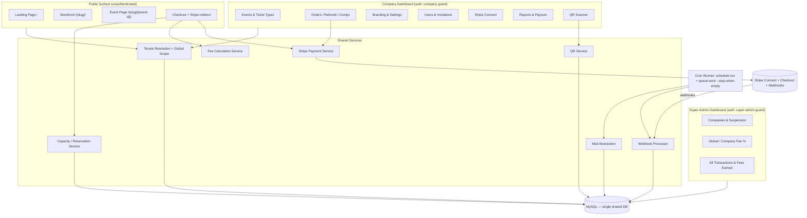
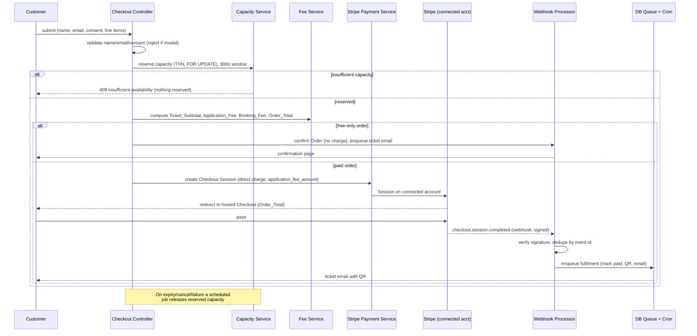
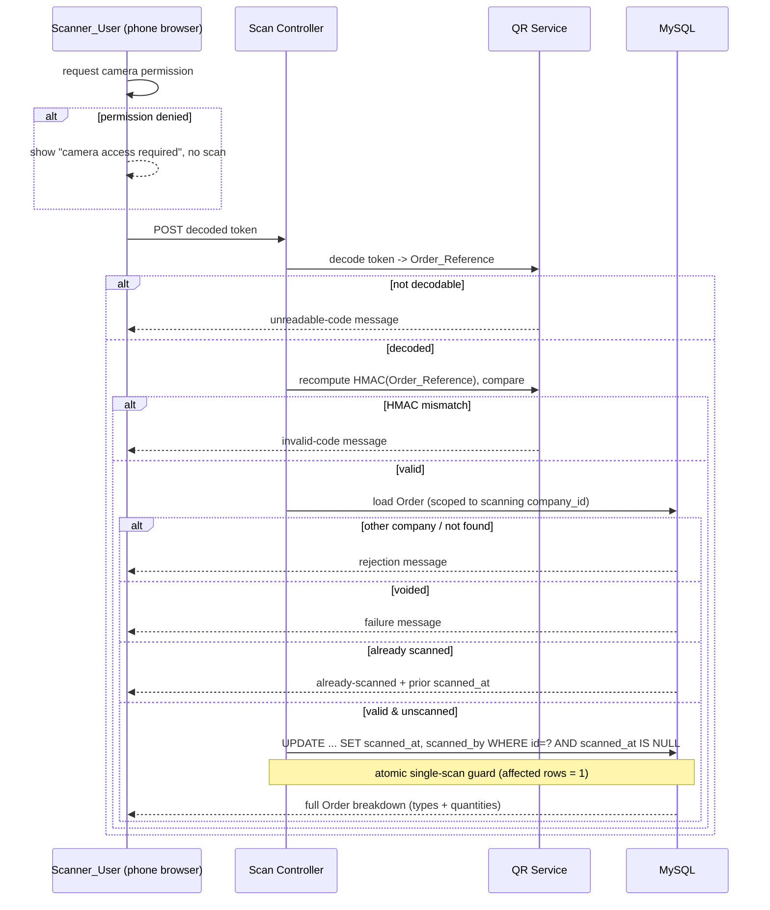
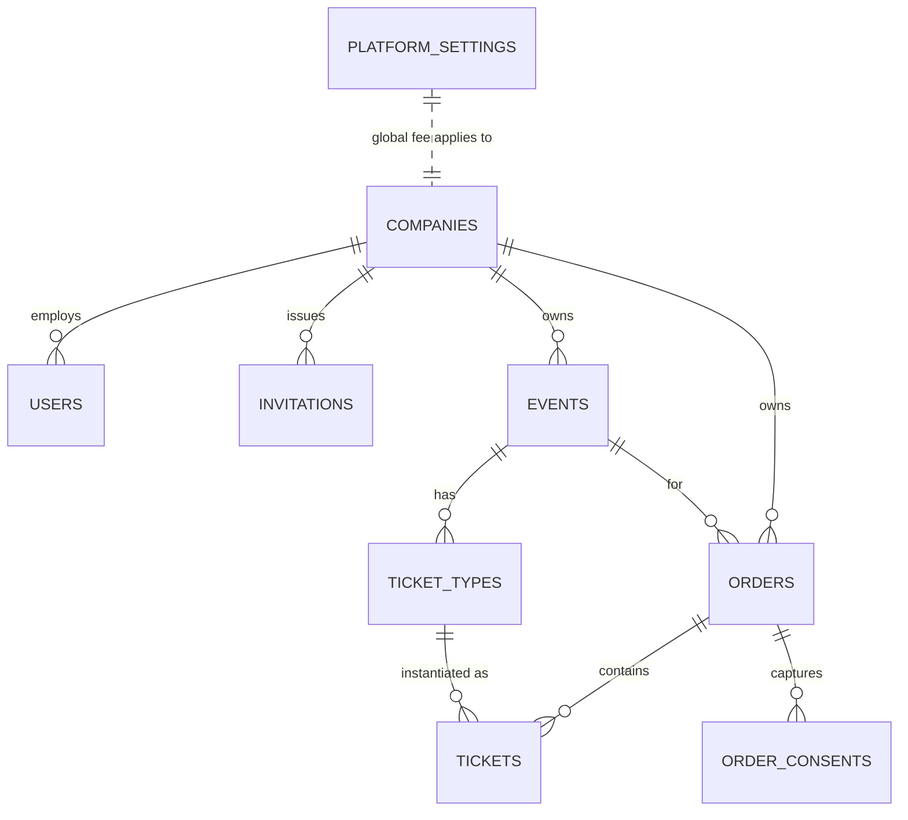

# Design Document

## Overview

The Event Ticketing Platform is a multi-tenant Laravel (PHP) + MySQL SaaS application deployed on shared cPanel hosting at `events.domain`. It lets charities and small organisers (Companies) sell tickets from branded, path-based storefronts, collect payments directly into their own Stripe accounts via Stripe Connect Standard, and check attendees in with a phone-browser QR scanner. CK Enterprises operates a separate super-admin dashboard to oversee all Companies, transactions, platform fees, suspensions, and fee configuration.

The design is shaped by three hard constraints that pervade every component:

1. **Shared hosting, no persistent worker.** All background work (ticket emails, webhook processing) runs on the database queue driver and is drained by a per-minute cron entry (`schedule:run` + `queue:work --stop-when-empty`). Nothing may assume a long-running process. (Requirements 14, 15, 19)
2. **Single shared database, tenant isolation by `company_id`.** Every Company-owned row carries `company_id`. Isolation is enforced in two layers: tenant-resolution middleware that resolves the active Company from the URL slug, and a global Eloquent query scope that constrains every query to the resolved `company_id`. (Requirement 1)
3. **Money is never touched by hand.** Fee computation, `Order_Total` derivation, and rounding are centralised in a single fee service with deterministic, testable rules. Card data never touches Platform servers — Stripe Checkout hosts the payment page. (Requirements 12, 13)

### Design Goals and Non-Goals

- **Goals:** simple event setup and checkout; a minimal, well-normalised schema; correctness of money and capacity under concurrency; reliable fulfilment despite the cron-only queue; strict tenant isolation.
- **Non-Goals (MVP):** native mobile apps, multi-currency per Company beyond a single Company currency, marketplace-wide search, or a persistent websocket layer.

### Key Technology Decisions

| Concern | Decision | Rationale |
| --- | --- | --- |
| Framework | Laravel (PHP) | Requirement constraint; batteries-included auth, queue, mail, validation. |
| Database | MySQL (single shared DB) | Requirement constraint; `SELECT ... FOR UPDATE` gives us row-level serialization for capacity. |
| Queue | `database` driver, cron-drained | Requirement 15; no persistent worker available on shared cPanel. |
| Payments | Stripe Connect **Standard**, **direct charges** with `application_fee_amount` | Requirement 11, 12; funds settle directly to the Company, Platform skims the fee. |
| Payment UI | Stripe Checkout Sessions | Requirement 12.5; PCI scope stays with Stripe, no card data on our servers. |
| QR | One QR per Order encoding an HMAC token of `Order_Reference` | Requirement 14.2; opaque, tamper-evident, no PII in the code. |
| Mail | Swappable mail abstraction over cPanel SMTP | Requirement 14.5; lets us swap to an API mailer later without touching callers. |
| Schema delivery | Migrations as source of truth **+** generated versioned raw SQL applied manually via phpMyAdmin on prod (no SSH) | Prod shared cPanel has no SSH; migrations run locally/CI, while committed `database/sql/*.sql` files are pasted into phpMyAdmin to apply schema/seed changes. See Hosting and Deployment Notes. |

## Architecture

### High-Level Component Map

The application is a single Laravel codebase with three logical surfaces sharing the database:

- **Public surface** — Landing page, Company storefronts, event pages, checkout, Stripe redirect return pages. Unauthenticated Customers.
- **Company dashboard** — Authenticated Company_Users (Owner/Admin/Accountant/Scanner) managing events, orders, branding, users, Stripe, reports, and the scanner.
- **Super-admin dashboard** — CK Enterprises operators overseeing all Companies, fees, and suspensions. Deliberately separate routing and guard.



### Request and Tenancy Flow

Path-based routing distinguishes the three surfaces. The landing page is at root; anything under `/{company-slug}/` is a Company storefront/event; dashboards live under reserved prefixes (`/dashboard`, `/admin`) that are excluded from slug resolution. Tenant-resolution middleware runs on the public and Company routes: it looks up the Company by a case-insensitive slug match, rejects with 404 when unresolved or suspended, then binds the `company_id` into the container so the global Eloquent scope constrains every subsequent query.

```mermaid
sequenceDiagram
    participant C as Customer/User
    participant R as Router
    participant TM as Tenant Resolution Middleware
    participant GS as Global company_id Scope
    participant DB as MySQL

    C->>R: GET /{slug}/... or /{slug}/{event-id}/
    R->>TM: dispatch (slug segment present)
    TM->>DB: SELECT * FROM companies WHERE LOWER(slug)=LOWER(?) LIMIT 1
    alt no match OR company suspended
        TM-->>C: HTTP 404 (no active Company established)
    else resolved & active
        TM->>GS: bind resolved company_id
        Note over GS: every read/write/update/delete<br/>gains WHERE company_id = :resolved
        GS->>DB: scoped query
        DB-->>C: tenant-isolated response
    end
    Note over R,TM: Reserved prefixes (/, /dashboard, /admin)<br/>skip slug resolution; no Company established
```

Cross-tenant access attempts (a resolved Company requesting a row owned by another `company_id`) never match under the scope, so they surface as 404 with no modification — satisfying 1.5. Requests with no slug segment establish no Company and are denied access to Company-owned records (1.7).

### Checkout and Payment Flow

Checkout reserves capacity atomically for a 900-second window, computes the money via the fee service, and (for paid orders) hands off to a Stripe Checkout Session created as a **direct charge on the connected account** with `application_fee_amount` set to the Platform fee. Free-only orders skip Stripe entirely and confirm immediately. The Order is only marked paid by the idempotent `checkout.session.completed` webhook — never by the browser redirect, which is treated as untrusted.



### Scan / Check-In Flow

The scanner is a phone-browser page using the device camera (via a JS camera/QR library, e.g. `getUserMedia` + a decoder) — no app install. Decoded tokens are POSTed to a scan endpoint that recomputes the HMAC over the Order_Reference, checks tenant ownership, and atomically marks the single check-in.



## Components and Interfaces

Components are grouped by responsibility. Each entry lists its purpose and the requirements it serves.

### Middleware

- **`ResolveTenant`** — Resolves the active Company from the leading slug segment (case-insensitive, within the 200ms budget via an indexed lookup / short-lived cache), returns 404 when unresolved, and binds `company_id`. Also returns 404 when the resolved Company is suspended (storefront/event access). *(1.2, 1.3, 2.1, 2.2)*
- **`EnforceTenantScope`** — Registers the global `company_id` query scope for the request lifecycle and clears it afterward. *(1.4, 1.5, 1.7)*
- **`EnsureCompanyActive`** (auth guard hook) — Blocks login/session for users of a suspended Company. *(2.3, 2.4)*
- **`SessionTimeout`** — Invalidates sessions idle for ≥30 minutes, forcing re-auth. *(3.11)*
- **`RoleAuthorization` / policies** — Gate each action by role; deny with an authorisation error otherwise. *(3.3–3.7, 3.10, 21.2)*
- **`VerifyStripeSignature`** — Verifies the Stripe webhook signature before any processing. *(19.1, 19.2)*

### Controllers

- **`LandingController`** — Root landing page. *(8.1)*
- **`StorefrontController`** — Company storefront listing published events; cached listing pages. *(8.2, 8.4, 9.1)*
- **`EventPageController`** — Public event page with available ticket types; not served when unpublished. *(8.3, 5.5)*
- **`CheckoutController`** — Validates customer/consent, drives reservation + fee computation, initiates Stripe or free confirmation; bypasses cache for availability. *(10.1–10.13, 9.2, 13.6)*
- **`StripeReturnController`** — Handles success/cancel redirects (display only; never authoritative for paid state). *(10.12)*
- **`WebhookController`** — Receives Stripe webhooks, verifies, dedupes, enqueues. *(19.1–19.5)*
- **Dashboard controllers** — `EventController`, `TicketTypeController`, `OrderController` (cancel/refund/comp), `BrandingController`, `UserController`/`InvitationController`, `StripeConnectController`, `ReportController`, `ScanController`. *(4.x, 5.x, 6.x, 7.x, 11.x, 16.x, 17.x, 18.x, 21.x)*
- **Super-admin controllers** — `SuperAdmin\CompanyController` (suspend/unsuspend), `SuperAdmin\FeeController` (global/company fee %), `SuperAdmin\TransactionController` (all transactions + total fees). *(20.1–20.7)*
- **`GdprController`** — Customer data export and delete/anonymise; privacy policy page. *(22.1–22.5)*

### Services

- **`TenantContext`** — Holds the resolved Company for the request and exposes `companyId()` to the global scope.
- **`FeeCalculationService`** — Pure, deterministic money engine. Given `Ticket_Subtotal`, the effective fee percent (Company override else Global), and `Fee_Handling_Mode`, it returns `Application_Fee`, `Booking_Fee`, and `Order_Total`. All money in integer minor currency units; percentage applied to subtotal; **round-half-up** to the minor unit; `Application_Fee` clamped to `[0, Ticket_Subtotal]`; free-only orders yield zero fee and no booking fee. *(12.2–12.4, 13.4–13.7)*
- **`CapacityReservationService`** — Reserves and releases capacity inside a DB transaction using `SELECT ... FOR UPDATE` on ticket-type rows (and the event capacity row) so concurrent checkouts serialize and can never oversell; enforces the 900s reservation window; releases on expiry/cancel/failure. *(5.6, 6.6–6.8, 10.6, 10.7, 18.3)*
- **`StripePaymentService`** — Wraps the Stripe SDK: creates Connect onboarding links, creates Checkout Sessions as direct charges with `application_fee_amount`, issues refunds on the connected account, and reads account capabilities. Injected/mocked in tests. *(11.1–11.5, 12.1–12.9, 17.2)*
- **`QrService`** — Generates the QR image encoding the signed token; computes and verifies `HMAC(Order_Reference)` with the Platform secret. *(14.1, 14.2, 16.3–16.5)*
- **`MailService` (abstraction)** — Interface `TicketMailer` with a `SmtpTicketMailer` (cPanel SMTP) implementation, bound in the container; a future `ApiTicketMailer` can be swapped without changing callers. *(14.4, 14.5)*
- **`OrderFulfilmentService`** — On confirmation: generates the QR, renders the branded ticket with custom fields, enqueues the ticket-email job. *(14.1, 14.3, 14.6, 18.2)*
- **`WebhookProcessor`** — Idempotent handler keyed on Stripe event id; dispatches `checkout.session.completed` (mark paid once), refund, dispute, and account-capability-update handlers, offloading heavy work to the DB queue. *(12.6, 12.7, 17.4, 17.5, 11.4, 19.3–19.5)*
- **`RoleService`** — Enforces the four-role model and the single-Owner invariant on assignment/removal/demotion. *(3.1, 3.2, 4.5)*
- **`GdprService`** — Exports and anonymises Customer personal data while retaining transactional records; scoped per Company. *(22.1, 22.2, 22.5)*

### Jobs (DB Queue)

- **`SendTicketEmailJob`** — Sends the branded ticket email via the mail abstraction. *(14.3, 14.4, 15.1)*
- **`ProcessWebhookJob`** — Performs the heavy webhook work enqueued by the processor. *(19.4)*
- **`ReleaseExpiredReservationsJob`** — Scheduled task releasing reservations past the 900s window. *(10.7)*
- Failed jobs are recorded in `failed_jobs` for inspection/retry. *(15.4)*

## Data Models

All money is stored as **integer minor currency units** (e.g. pence) to avoid floating-point error. All Company-owned tables carry `company_id` (indexed) and rely on the global scope. Timestamps are UTC.

### `platform_settings`
Single-row (or key/value) table holding Platform-wide config.

| Column | Type | Notes |
| --- | --- | --- |
| `id` | PK | |
| `global_fee_percent` | DECIMAL(5,2) | Default Platform fee %. *(20.5)* |
| `created_at` / `updated_at` | timestamps | |

### `companies`
| Column | Type | Notes |
| --- | --- | --- |
| `id` | PK | `company_id` referenced elsewhere. |
| `name` | VARCHAR | |
| `slug` | VARCHAR(255) | UNIQUE; lowercase alphanumeric + hyphens; case-insensitive lookup. *(1.6)* |
| `status` | ENUM(`active`,`suspended`) | Suspension flag. *(2.x, 20.3, 20.4)* |
| `fee_handling_mode` | ENUM(`absorb`,`pass_on`) | Default `absorb`. *(13.1, 13.2)* |
| `company_fee_percent` | DECIMAL(5,2) NULL | Override; NULL = use global. *(12.3, 12.4, 20.6)* |
| `stripe_account_id` | VARCHAR NULL | Connected account. *(11.2)* |
| `stripe_charges_enabled` | BOOLEAN | From capability updates. *(11.3, 11.4)* |
| `currency` | CHAR(3) | Company currency. |
| `primary_colour` | VARCHAR(7) NULL | Branding. *(7.2)* |
| `logo_path` | VARCHAR NULL | Branding. *(7.1)* |
| `terms_text` | TEXT NULL | Shown at checkout. *(7.3)* |
| `ticket_field_defs` | JSON NULL | Custom ticket info fields. *(7.4)* |
| `created_at` / `updated_at` | timestamps | |

### `users`
| Column | Type | Notes |
| --- | --- | --- |
| `id` | PK | |
| `company_id` | FK NULL | NULL for Super_Admin. |
| `is_super_admin` | BOOLEAN | Super-admin flag (separate surface). *(20.1, 20.7)* |
| `role` | ENUM(`owner`,`admin`,`accountant`,`scanner`) NULL | Company role. *(3.1)* |
| `name`, `email` | VARCHAR | `email` unique per scope. |
| `password` | VARCHAR | Hashed. |
| `last_activity_at` | TIMESTAMP | For 30-min idle timeout. *(3.11)* |
| `created_at` / `updated_at` | timestamps | Partial unique index enforcing one `owner` per `company_id`. *(3.2)* |

### `invitations`
| Column | Type | Notes |
| --- | --- | --- |
| `id` | PK | |
| `company_id` | FK | *(4.1)* |
| `email` | VARCHAR | |
| `role` | ENUM(`admin`,`accountant`,`scanner`) | Owner not invitable. *(4.6)* |
| `token` | VARCHAR | Accept link. |
| `accepted_at` | TIMESTAMP NULL | *(4.2)* |
| `expires_at` | TIMESTAMP | |

### `events`
| Column | Type | Notes |
| --- | --- | --- |
| `id` | PK | Used in `/{slug}/{event-id}/`. |
| `company_id` | FK | *(5.1)* |
| `name`, `description`, `venue`, `starts_at` | | Event details. |
| `capacity` | INT NULL | Overall capacity. *(5.2, 5.6)* |
| `is_published` | BOOLEAN | *(5.4, 5.5)* |
| `primary_colour`, `logo_path`, `ticket_field_defs` | overrides NULL | Event-level branding overrides. *(7.5)* |
| `created_at` / `updated_at` | timestamps | |

### `ticket_types`
| Column | Type | Notes |
| --- | --- | --- |
| `id` | PK | |
| `company_id`, `event_id` | FK | 1–50 per event. *(6.2)* |
| `name` | VARCHAR(100) | *(6.1)* |
| `price_minor` | INT | 0 = free. *(6.1, 6.3)* |
| `capacity` | INT | 1–1,000,000. *(6.1)* |
| `sold_count` | INT | Confirmed sold. |
| `reserved_count` | INT | Held during reservation windows. |
| `sale_starts_at`, `sale_ends_at` | TIMESTAMP | `end` strictly after `start`. *(6.9)* |
| `created_at` / `updated_at` | timestamps | |

Remaining available = `capacity - sold_count - active_reserved`. *(6.6–6.8, 10.6)*

### `orders`
| Column | Type | Notes |
| --- | --- | --- |
| `id` | PK | |
| `company_id`, `event_id` | FK | Tenant + event scope. |
| `order_reference` | VARCHAR | UNIQUE across Platform. *(10.13)* |
| `customer_name` | VARCHAR(200) | *(10.1)* |
| `customer_email` | VARCHAR(254) | *(10.1)* |
| `status` | ENUM(`reserved`,`paid`,`free_confirmed`,`expired`,`cancelled`,`refunded`,`disputed`,`voided`) | Lifecycle. *(10.7, 10.9, 12.6, 17.x)* |
| `ticket_subtotal_minor` | INT | *(Glossary Ticket_Subtotal)* |
| `booking_fee_minor` | INT | 0 in Absorb / free. *(13.4, 13.5, 13.7)* |
| `application_fee_minor` | INT | Platform fee. *(12.2)* |
| `order_total_minor` | INT | *(10.10, 13.4, 13.5)* |
| `fee_handling_mode` | ENUM | Snapshot at creation (immutable per order). *(13.8)* |
| `reserved_until` | TIMESTAMP NULL | 900s window. *(10.6, 10.7)* |
| `stripe_session_id`, `stripe_charge_id`, `stripe_payment_intent_id` | VARCHAR NULL | Stripe linkage. |
| `scanned_at` | TIMESTAMP NULL | Single check-in. *(16.8)* |
| `scanned_by` | FK users NULL | *(16.8)* |
| `created_at` / `updated_at` | timestamps | |

### `tickets`
| Column | Type | Notes |
| --- | --- | --- |
| `id` | PK | |
| `company_id`, `order_id`, `ticket_type_id` | FK | One row per purchased/claimed ticket. *(10.5)* |
| `status` | ENUM(`valid`,`voided`) | Voided on cancel/refund. *(17.3)* |
| `created_at` / `updated_at` | timestamps | |

### `order_consents`
| Column | Type | Notes |
| --- | --- | --- |
| `id` | PK | |
| `company_id`, `order_id` | FK | |
| `consent_key` | VARCHAR | e.g. `terms`, `privacy`, `marketing`. |
| `accepted` | BOOLEAN | Captured at checkout. *(10.3, 10.4, 22.4)* |
| `captured_at` | TIMESTAMP | |

### `processed_webhooks`
| Column | Type | Notes |
| --- | --- | --- |
| `id` | PK | |
| `stripe_event_id` | VARCHAR | UNIQUE — idempotency key. *(19.3)* |
| `type` | VARCHAR | Event type. |
| `processed_at` | TIMESTAMP | |

### `jobs` / `failed_jobs`
Standard Laravel DB-queue tables. `failed_jobs` records failures for inspection/retry. *(15.1, 15.4)*

### Entity Relationships



## Correctness Properties

*A property is a characteristic or behavior that should hold true across all valid executions of a system-essentially, a formal statement about what the system should do. Properties serve as the bridge between human-readable specifications and machine-verifiable correctness guarantees.*

The properties below were derived from the acceptance criteria via prework analysis and then consolidated to remove redundancy (see reflection notes in the design conversation). Each is universally quantified and maps back to the requirements it validates. All money is reasoned about in integer minor currency units.

### Property 1: Tenant isolation

*For any* set of Companies each owning random records, when one Company is resolved for a request, every read, write, update, and delete operation returns or affects only records whose `company_id` equals the resolved Company's `company_id`; any attempt to access or modify a record owned by a different Company is denied and leaves that record byte-for-byte unchanged. This holds equally for scan lookups and GDPR export/delete operations.

**Validates: Requirements 1.4, 1.5, 3.8, 3.10, 16.6, 22.5**

### Property 2: Unresolved / missing tenant establishes no Company

*For any* request whose leading path segment does not match a stored Company_Slug (case-insensitively), the Platform establishes no active Company, returns HTTP 404 for slug paths, and denies access to all Company-owned records; and *for any* valid slug, requesting it in any letter-case resolves to the same Company.

**Validates: Requirements 1.2, 1.3, 1.7**

### Property 3: Slug validity

*For any* candidate slug string, the Platform accepts it if and only if it is 1–255 characters, consists solely of lowercase alphanumeric characters and hyphens, and is not already used by another Company.

**Validates: Requirements 1.6**

### Property 4: Suspension gating and reversibility

*For any* Company, its Storefront, Event pages, ticket sales, and Company_User logins are available if and only if the Company is not suspended; and suspending then unsuspending a Company restores access to the same state as an equivalent never-suspended active Company.

**Validates: Requirements 2.1, 2.2, 2.3, 2.4, 2.5**

### Property 5: Owner uniqueness invariant

*For any* sequence of user add/invite-accept/role-change/removal operations on a Company, the Company always has exactly one Owner; any operation that would produce zero or more than one Owner is rejected and leaves the existing Owner assignment unchanged.

**Validates: Requirements 3.2, 4.5**

### Property 6: Role permission matrix

*For any* (role, action) pair, the Platform authorises the action if and only if the action belongs to that role's permitted set (Owner: billing/Stripe/settings/users; Admin: events/ticket-types/orders incl. cancel/refund/comp; Accountant: read-only reports/payouts; Scanner: check-in only); denied actions leave all data unchanged.

**Validates: Requirements 3.3, 3.4, 3.5, 3.6, 3.7, 20.7, 21.1, 21.2**

### Property 7: Session idle timeout boundary

*For any* session and any idle duration, the Platform requires re-authentication before further action if and only if the idle duration is at least 30 minutes.

**Validates: Requirements 3.11**

### Property 8: Publish and sale-window gating

*For any* Event and Ticket_Type, a Customer may view and purchase the Ticket_Type if and only if the Event is published and the current time is at or after the sale-window start and strictly before the sale-window end.

**Validates: Requirements 5.5, 6.4, 6.5**

### Property 9: Ticket-type field and sale-window validation

*For any* Ticket_Type creation input, the Platform accepts it if and only if the name is 1–100 characters, the price is within 0.00–999,999.99, the capacity is within 1–1,000,000, and the sale-window end is strictly after the sale-window start; accepted inputs are stored faithfully (a round trip of the stored fields returns the submitted values).

**Validates: Requirements 6.1, 6.9**

### Property 10: No oversell under concurrency

*For any* Event capacity and Ticket_Type capacities, and *any* interleaving of concurrent reservation, purchase, and complimentary-issuance requests, the cumulative committed-plus-active-reserved quantity never exceeds the Ticket_Type capacity (nor the Event's overall capacity); and any single request whose requested quantity exceeds the remaining available capacity at processing time is rejected in full, reserving nothing and leaving prior counts unchanged.

**Validates: Requirements 5.6, 6.6, 6.7, 6.8, 10.6, 18.3**

### Property 11: Reservation release restores availability

*For any* reservation, if the Order's payment is not completed within the 900-second window, or the payment fails or is cancelled, the reserved capacity is released so that each affected Ticket_Type's available capacity returns to the value it held immediately before the reservation.

**Validates: Requirements 10.7, 10.12**

### Property 12: Checkout customer and consent validation

*For any* checkout submission, the Platform creates an Order if and only if the customer name (1–200 chars) and email (1–254 chars) are present and non-blank and every required consent flag is accepted; otherwise no Order is created and an error identifies the invalid field or missing consent. When an Order is created, the stored consent selections equal the submitted selections.

**Validates: Requirements 10.1, 10.2, 10.3, 10.4, 22.4**

### Property 13: Ticket rows match requested quantities

*For any* Order created from a set of line items, exactly one Ticket row is created per purchased or claimed ticket, so the total Ticket count equals the sum of requested quantities and the per-Ticket_Type counts equal the requested per-type quantities.

**Validates: Requirements 10.5**

### Property 14: Order_Reference uniqueness

*For any* set of Orders created across any Companies, all assigned Order_Reference values are distinct.

**Validates: Requirements 10.13**

### Property 15: Charges-enabled gating

*For any* Company, checkout for paid Ticket_Types is permitted if and only if the Company has a connected Stripe account with charges enabled; free-only orders are always permitted regardless.

**Validates: Requirements 10.8, 11.3**

### Property 16: Application fee computation, selection, clamping, and rounding

*For any* Ticket_Subtotal and Company, the Application_Fee equals the Ticket_Subtotal multiplied by the effective fee percent (the Company_Fee_Percent if set, otherwise the Global_Fee_Percent), rounded to the nearest minor currency unit using round-half-up, and clamped to the range `[0, Ticket_Subtotal]`; the `application_fee_amount` sent to Stripe equals this computed Application_Fee.

**Validates: Requirements 12.2, 12.3, 12.4, 20.5, 20.6**

### Property 17: Order_Total consistency across fee modes

*For any* paid Order, in Absorb mode the Order_Total equals the Ticket_Subtotal and the Booking_Fee is zero; in Pass_On mode the Booking_Fee equals the Application_Fee and the Order_Total equals the Ticket_Subtotal plus the Booking_Fee; and the direct charge amount created on the connected account equals the Order_Total.

**Validates: Requirements 10.10, 12.1, 13.4, 13.5**

### Property 18: Free orders incur no money and no charge

*For any* Order consisting solely of free Ticket_Types, the Ticket_Subtotal, Application_Fee, Booking_Fee, and Order_Total are all zero, no Stripe charge is created, and the Order completes without payment, regardless of the Company's Fee_Handling_Mode.

**Validates: Requirements 10.9, 12.9, 13.7**

### Property 19: Fee-mode change does not mutate existing orders

*For any* existing Order, changing the Company's Fee_Handling_Mode leaves that Order's fee mode snapshot and money fields unchanged, while Orders created after the change use the new mode.

**Validates: Requirements 13.8**

### Property 20: Webhook signature gating

*For any* webhook payload, the Platform accepts and processes it if and only if its Stripe signature is valid; invalid signatures are rejected with an error and produce no state change.

**Validates: Requirements 19.1, 19.2**

### Property 21: Webhook idempotency

*For any* Stripe event delivered one or more times, the Platform processes it at most once; in particular a `checkout.session.completed` event marks its Order paid exactly once and creates no additional charge on redelivery, and the Order status is otherwise left unchanged.

**Validates: Requirements 12.6, 12.7, 19.3**

### Property 22: Direct-charge failure leaves order unpaid

*For any* Order whose direct charge fails, the Order remains unpaid, no funds are transferred to the Company, and an error is surfaced to the Customer.

**Validates: Requirements 12.8**

### Property 23: One QR per order and token validity

*For any* confirmed Order, exactly one QR_Code is generated encoding a token equal to `HMAC(secret, Order_Reference)`; verification succeeds for that token and fails for any tampered or foreign token.

**Validates: Requirements 14.1, 14.2, 16.4, 16.5**

### Property 24: Single atomic check-in

*For any* valid, unscanned Order and *any* number or interleaving of concurrent scan attempts, exactly one scan records the check-in (setting `scanned_at` and `scanned_by` once); the recorded `scanned_at` never changes thereafter, and every subsequent scan reports an already-scanned result carrying the original `scanned_at`.

**Validates: Requirements 16.8, 16.9**

### Property 25: Cancel/refund voids tickets and blocks scan

*For any* Order, after it is cancelled or refunded (including via refund/dispute webhooks) all of its Tickets are voided, and any subsequent scan of that Order's QR_Code is rejected as a failure.

**Validates: Requirements 16.10, 17.3, 17.4, 17.5**

### Property 26: Total fees earned aggregation

*For any* set of paid Orders across all Companies, the total Application_Fees reported on the super-admin dashboard equals the sum of the recorded Application_Fee values of those Orders.

**Validates: Requirements 20.2**

### Property 27: GDPR anonymisation retains transactional records

*For any* Customer, after a scoped delete/anonymise request, no personal data (name, email, custom personal fields) remains in identifiable form, while the transactional records (Order references, amounts, fee figures) required for reconciliation are retained; and a data export for a Customer contains every stored personal field for that Customer.

**Validates: Requirements 22.1, 22.2**

## Error Handling

Errors are handled at the layer that owns the invariant, and always fail closed (deny + no partial state change).

- **Tenant / authorization errors.** Unresolved slug, suspended Company, or cross-Company access → HTTP 404 with no active Company and no data change (Property 1, 2, 4). Role violations → 403 authorization error naming the disallowed action, data unchanged (Property 6). Idle-timeout → session invalidated, redirect to re-auth (Property 7).
- **Validation errors.** Slug, ticket-type fields/window, and checkout customer/consent validation reject the whole request with a field-specific message and create nothing (Properties 3, 9, 12). Validation runs before any reservation or charge.
- **Capacity errors.** Over-requests and races are resolved inside a DB transaction with `SELECT ... FOR UPDATE`; a request that cannot be fully satisfied is rejected atomically with an insufficient-availability error and reserves nothing (Property 10). Expiry/failure release is idempotent (Property 11).
- **Payment errors.** The browser redirect is never trusted to mark payment; only the signed, idempotent webhook does (Properties 20, 21). Charge failures leave the Order unpaid and surface a payment-not-completed error; reserved capacity is released (Properties 22, 11). Attempts to pay for a Company without charges enabled are blocked before Stripe is called (Property 15).
- **Webhook errors.** Invalid signatures are rejected (Property 20). Duplicate deliveries are deduped via `processed_webhooks.stripe_event_id` (Property 21). Handler exceptions leave the queued job to retry; persistent failures land in `failed_jobs` for inspection (15.4).
- **Scan errors.** Undecodable payload → unreadable message; HMAC mismatch → invalid message; foreign Company → rejection; voided Order → failure; already-scanned → warning with original `scanned_at`. All are user-visible messages on the scanner page, and only a valid unscanned Order mutates state (Properties 23, 24, 25).
- **Queue / mail errors.** Failed jobs retry then move to `failed_jobs`; the mail abstraction surfaces transport errors as job failures rather than losing the ticket email.

## Testing Strategy

The feature is rich in pure and deterministic logic (fee/total computation, HMAC tokens, capacity arithmetic, tenant scoping, idempotency, single-scan), so **property-based testing (PBT) is appropriate** and is the primary correctness tool, complemented by feature tests. Stripe is always mocked in automated tests; card data never appears.

### Dual approach

- **Property-based tests** verify the 27 universal properties above across generated inputs. Use a PHP PBT library (e.g. Eris or an equivalent) — do not hand-roll a generator framework. Each property test runs a **minimum of 100 iterations** and is tagged with a comment referencing its design property using the format:
  `// Feature: event-ticketing-platform, Property {number}: {property text}`
  Each correctness property is implemented by a **single** property-based test.
- **Feature / example tests** (Laravel HTTP + database tests) cover concrete behaviours and mechanisms that are not universal: the four-role enum (3.1), invalid-credential rejection (3.9), invitation accept/change/remove flows (4.2–4.4, 4.6), route rendering for landing/storefront/event/privacy pages (8.1–8.3, 22.3), capability-update enabling paid sales (11.4), refund/dispute webhook transitions (17.2, 17.4, 17.5), and enqueue-on-confirm of the ticket email (14.3, 19.4).
- **Smoke tests** cover configuration and infrastructure that does not vary with input: the cron command draining the DB queue (15.2, 15.3) and camera/permission behaviour of the scanner (16.1, 16.2, verified manually in a phone browser).

### Concurrency testing

Properties 10 and 24 (no oversell, single check-in) are exercised with concurrent/interleaved requests against a real MySQL transaction using `SELECT ... FOR UPDATE`, asserting the invariant across many randomized interleavings and initial capacities.

### Stripe boundary

`StripePaymentService` is an interface with a real SDK-backed implementation and a fake/mock used in tests. Property tests assert the composition of Stripe calls (charge amount == Order_Total on the connected account, `application_fee_amount` == computed fee) against the mock rather than the live API.

### Test data generators

Generators cover: multiple Companies with random slugs/statuses/fee configs; events with random publish flags and capacities; ticket types spanning free/paid and boundary field values; line-item sets with random quantities; consent selections; idle durations around the 30-minute boundary; subtotal/percent pairs chosen to hit round-half-up boundaries; and tampered/garbage QR payloads for scan edge cases.

## Hosting and Deployment Notes (shared cPanel)

- **Cron entry (per minute).** A single cron job runs the scheduler, which both triggers scheduled tasks and drains the queue:
  ```
  * * * * * cd /home/USER/events.domain && php artisan schedule:run >> /dev/null 2>&1
  ```
  The scheduler is configured to call `queue:work --stop-when-empty` (and `ReleaseExpiredReservationsJob`) each minute, so no persistent worker is required. (Requirements 15.2, 15.3)
- **Queue configuration.** `QUEUE_CONNECTION=database`; run `queue:table`, `queue:failed-table`, and migrate so `jobs` and `failed_jobs` exist. Failed jobs are inspected/retried via `queue:retry`. (Requirements 15.1, 15.4)
- **Database schema (no SSH on prod).** Production runs on shared cPanel with **no SSH access** — only phpMyAdmin. To keep schema changes applyable there while retaining a single source of truth:
  - **Migrations remain the source of truth.** Laravel migrations run normally locally and in CI (including the property-based test suite, which builds a fresh MySQL schema from migrations). Nothing about the local/CI workflow changes.
  - **Generate versioned raw SQL alongside each migration.** For every schema change, produce a matching raw `.sql` file committed under `database/sql/`, named with an incrementing/timestamp prefix (e.g. `001_create_companies.sql`) that contains the exact DDL. Generate the SQL from the migrations — `php artisan migrate --pretend` prints the statements a migration would run, or `php artisan schema:dump` emits a consolidated schema — then save and commit the output. Do not hand-write the SQL.
  - **Include the Laravel-managed tables.** The generated SQL must also create the `migrations`, `jobs`, `failed_jobs`, and `processed_webhooks` tables so the entire schema — including the queue and webhook-idempotency tables — can be stood up through phpMyAdmin alone.
  - **Seed SQL for platform settings.** Generate a seed `.sql` file inserting the single `platform_settings` row with the default `global_fee_percent`, so a fresh prod database has the required Platform-wide config.
  - **Applying on prod.** The user pastes the ordered `.sql` files into phpMyAdmin (Import / SQL tab) in filename order. There is no web deploy route — schema is applied purely by pasting SQL. Applied files are tracked manually via a lightweight convention: a comment header in each file plus a short `CHANGELOG`, and/or the generated SQL can insert the corresponding rows into the Laravel `migrations` table so the app's migration state stays consistent if migrations are ever run against that database later.
  - **Avoid drift.** Keep the generated SQL byte-consistent with the migrations; regenerate the affected `.sql` file whenever its migration changes so the two never diverge.
- **Storage symlink.** `php artisan storage:link` (or a manual symlink on cPanel where the command is restricted) exposes uploaded logos under the public path for storefront and ticket rendering. (Requirement 7.1)
- **Webhook endpoint.** A single public route (e.g. `POST /stripe/webhook`) is registered in Stripe with the signing secret; it is exempt from CSRF and from tenant-slug resolution, verifies the signature, dedupes on event id, and enqueues heavy work. (Requirements 19.1–19.5)
- **Environment / secrets.** Stripe API keys, Connect client id, webhook signing secret, the QR HMAC secret, and cPanel SMTP credentials live in `.env` outside the web root. The HMAC secret must be stable across deploys so previously issued QR tokens continue to verify (Property 23).
- **Mail.** `MAIL_MAILER=smtp` pointing at the cPanel mail host by default; the `TicketMailer` binding can later be swapped to an API mailer without changing callers. (Requirements 14.4, 14.5)

## Requirements Traceability Summary

| Requirement | Covered by |
| --- | --- |
| 1 Tenant isolation | ResolveTenant/EnforceTenantScope middleware; Properties 1, 2, 3 |
| 2 Suspension | ResolveTenant, EnsureCompanyActive; Property 4 |
| 3 Auth & roles | RoleService, policies, SessionTimeout; Properties 5, 6, 7 |
| 4 Invitations | InvitationController/RoleService; Property 5; feature tests |
| 5 Events | EventController; Properties 8, 10 |
| 6 Ticket types | TicketTypeController, CapacityReservationService; Properties 8, 9, 10 |
| 7 Branding | BrandingController; branding-resolution + render tests |
| 8/9 Storefront & cache | Storefront/EventPage/Checkout controllers; feature tests + Property 8 |
| 10 Checkout | CheckoutController, CapacityReservationService, FeeCalculationService; Properties 10, 11, 12, 13, 14, 15, 17, 18 |
| 11 Stripe Connect | StripeConnectController, StripePaymentService; Property 15; feature tests |
| 12 Payment & fee | StripePaymentService, FeeCalculationService, WebhookProcessor; Properties 16, 17, 18, 21, 22 |
| 13 Fee mode | FeeCalculationService; Properties 17, 18, 19 |
| 14 Fulfilment/email | OrderFulfilmentService, QrService, MailService; Property 23; feature tests |
| 15 Cron queue | DB queue jobs, cron; smoke tests + deployment notes |
| 16 Scanning | ScanController, QrService; Properties 1, 23, 24, 25 |
| 17 Refunds | OrderController, StripePaymentService, WebhookProcessor; Property 25 |
| 18 Comps | OrderController; Properties 10, 13, 18 |
| 19 Webhooks | VerifyStripeSignature, WebhookProcessor; Properties 20, 21 |
| 20 Super-admin | SuperAdmin controllers; Properties 6, 16, 26 |
| 21 Reporting | ReportController; Properties 1, 6 |
| 22 GDPR | GdprController, GdprService; Properties 1, 12, 27 |
